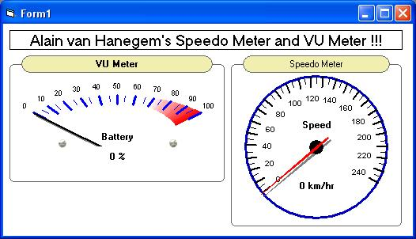



## Speedo and VU Meters ActiveX Controls

### Description

Some time ago I found at PSC a great code made by Alain van Hanegem of a Speedo Meter and a VU Meter class control. The code was great, very useful and one of the best codes I've found here at PSC, but it takes lots of time to configure and customize, and also it is a little difficult for begginers. Thinking on that, I've made the ActiveX UserControls for these meters, and I tried to put on it all the potential of the original class control. It has tons of properties and is much easier and faster to configure. If you are a begginner, I really suggest you at least take a look on my code, but if you didn't have any problems using the original class control, I suggest you to continue using it, because it is lighter, faster (I guess) and uses less PC Resorces. Once again thanks Alain van Hanegem for the incredible original code and allowing me to post these UserControls. Please post any comments and suggestions!
 
### More Info
 
Lots of inputs to customize the Meters, ranging from appearance to behavior. It is possible to customize colors, texts, fonts, angles, values and much more!

As being an UserControl, it is heavier and slower than the original class control, and also uses more PC Resources.

             |
---                |---
**Submitted On**   |2006-02-23 08:03:00
**By**             |[Andre Felipe N\. D\.](https://github.com/Planet-Source-Code/PSCIndex/blob/master/ByAuthor/andre-felipe-n-d.md)
**Level**          |Beginner
**User Rating**    |5.0 (30 globes from 6 users)
**Compatibility**  |VB 6\.0
**Category**       |[Custom Controls/ Forms/  Menus](https://github.com/Planet-Source-Code/PSCIndex/blob/master/ByCategory/custom-controls-forms-menus__1-4.md)
**World**          |[Visual Basic](https://github.com/Planet-Source-Code/PSCIndex/blob/master/ByWorld/visual-basic.md)
**Archive File**   |[Speedo\_and1975792232006\.zip](https://github.com/Planet-Source-Code/andre-felipe-n-d-speedo-and-vu-meters-activex-controls__1-64430/archive/master.zip)

